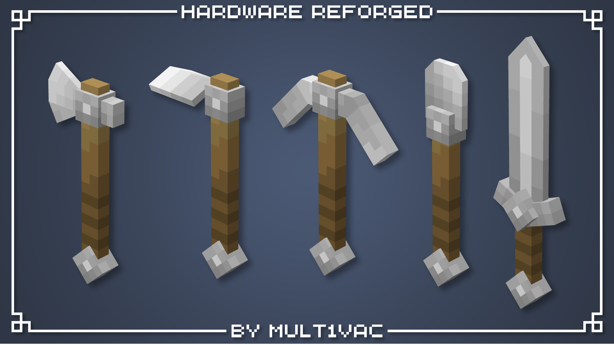

</a>
 
 

<h1>Hardware Reforged Resource Pack</h1>

## 🔥  About
**Hardware Reforged** is a resource pack that revamps vanilla tools and weapons. Complete with all tool materials, fishing rods, bow, crossbow, mace, and trident!

## ⚙️ Compatibility & Usage
This pack requires versions `1.21.4` and above. Install [EMF](https://modrinth.com/mod/entity-model-features) for the trident to work properly.

Resource packs that changes all vanilla tools, fishing rods, bows, crossbows, mace, and trident are **NOT** compatible.

Make sure the this pack is placed **above** any other resource packs to avoid conflicts.

## 📝 Attribution

All models and textures in *Hardware Reforged* is made by me. However, this pack is inspired and influenced by [Gray's 3D Items](https://modrinth.com/resourcepack/grays-3d-items). Check out more of their work on [Modrinth](https://modrinth.com/user/CanineGray).

## 🖊️ Terms of Use

This resource pack is licensed under the **Creative CommonsAttribution-NonCommercial 4.0 International License (CC BY-NC 4.0)**. See `LICENSE` for more information.

### By downloading this resource pack, you agree to the terms below.

**With this resource pack, you may:**

- Share and redistribute the pack in any medium or format with approriate credit and included links.
- Modify the pack for your own personal use.
- Adapt, remix, or build upon the assets.
- Use the pack in content such as videos, livestreams, or blog posts provided that you link this page in said content.

**With this resource pack, you may NOT:**

- Use this pack or any part of it for commercial purposes (e.g., include in paid content, put behind download paywalls, upload in Bedrock Marketplace, etc.).
- Redistribute a modified version without providing a link to the original resource pack and license.
- Claim the work as your own.

## 💡 Future Plans

I'm currently doing a mod compatibilty pack for [Spellbound Weapons](https://modrinth.com/datapack/spellbound-weapons) in the same style and art direction as Hardware Reforged. I'm considering doing the shield and all armor sets.

## 👋 Feedback
If you have any feedback or find any errors or corrections, please report them on the [GitHub Issues page](https://github.com/mult1v4c/Hardware-Reforged/issues).

## ❤️ Support
If you appreciate the effort put into this pack, please consider supporting me on [Ko-fi](https://ko-fi.com/mult1v4c). Your support is greatly appreciated!